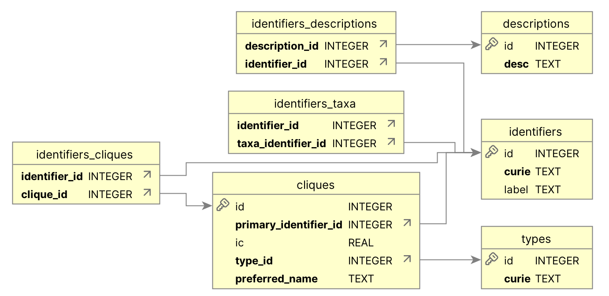

# stitch
Some tools for building a Translator BigKG. This software project is experimental and unfinished.

# Introduction There are two types of intended users for this software suite,
someone who is tasked with ingesting the
[Babel concept identifier normalization database](https://github.com/TranslatorSRI/Babel)
into a local sqlite databse (an "ingester") and someone developing a
application, such as a BigKG build system, that wants to programmatically query
a local Babel sqlite database for node normalization, etc. ("querier"). The
"ingester" type user will need to rea this entire README document, in order to
be able to set up and run the `ingest_babel.py` program to carry out an ingest
of Babel into a local sqlite database. The "querier" type user can skip over the
sections of this document that discuss ingesting Babel, and focus on the
sections about downloading the pre-built Babel sqlite database from S3 and using
the `local_babel.py` python module that provides functions for querying the
local Babel sqlite database.

# Tools
- `ingest_babel.py`: downloads and ingests the Babel concept identifier synonymization database into a local sqlite3 relational database
- `local_babel.py`: functions for querying the local Babel sqlite database
- `row_counts.py`: a script that prints out the row counts of the tables in the local Babel sqlite database

# Requirements
- CPython 3.12, which needs to be available in your path as `python3.12`
- At least 32 GiB of system memory
- To build `babel.sqlite`, at least 600 GiB of free file system storage space (usage transiently spikes to ~522 GiB and then the final database size is ~172 GiB).
- To use a local `babel.sqlite` in your application, 200 GiB of free system storage space to store the sqlite file.
- Linux or MacOS (this software was not tested on Windows); see "Systems on which this software has been tested"

# Systems on which this software has been tested
Stitch has only been tested in two compute environments:
## Ubuntu/Graviton
- Ubuntu 24.04
- `c7g.4xlarge` instance (Graviton3 processor, which is ARM64 architecture), 32 GiB of memory
- `gp3` root volume (800 GiB)
- The following packages need to be `apt` installed: `sqlite3`, `build-essential`, `gcc`, `g++`, `make`, `libffi-dev`, `libssl-dev`, `zlib1g-dev`, `libbz2-dev`, `libreadline-dev`, `libsqlite3-dev`, `libncursesw5-dev`, `tk-dev`, `libgdbm-dev`, `libnss3-dev`, `liblzma-dev`, `uuid-dev`, `python3-dev`, `gfortran`, `libopenblas-dev`, `liblapack-dev`, `libfreetype6-dev`, `libpng-dev`, `libjpeg-dev`, `libtiff-dev`, `libffi-dev`, `liblzma-dev`, `pkg-config`, `cmake`, `python3.12-venv`
- CPython, Numpy, and Pandas need to be compiled locally using gcc/g++ with the following CFLAGS:
```-mcpu=neoverse-v1 -mtune=neoverse-v1 -march=armv8.4-a+crypto -O3 -pipe```

## MacOS/Apple Silicon
For reasons I don't fully understand, `ingest_babel.py` runs quite fast on the M1 Max, compared to
the Graviton3 processor. I've tested on the following MacOS system:
- MacOS 14.6.1
- Apple M1 Max processor, 64 GiB of memory
- Apple SSD AP2048R Media SSD (2 TiB)
- `python3.12` installed via Homebrew
- `openblas` installed via Homebrew

# Python distribution package requirements 
All external PyPI distribution package requirements for Stitch are listed in the
[`requirements.txt`](https://github.com/Translator-CATRAX/stitch/blob/main/requirements.txt) file.  Stitch's `run-checks.sh` script (see section "Running
the type checks, lint checks, ..." below) depends on the packages `pytest`,
`ruff`, and `vulture`.  For a "querying" type user that is just using
`local_babel.py`, only three PyPI distribution packages are needed, `requests`,
`numpy`, and the Biolink Model Toolkit (`bmt`). Additionally, for an "ingester"
type user who wants to run `ingest_babel.py` to build a local Babel sqlite
database from scratch, the PyPI packages `pandas`, `ray`, `swifter`, and
`htmllistparse` are needed. The stitch `requirements.txt` file contains
the full set of dependencies.

# Setup of a python virtualenv for using the `stich` software
- `ssh ubuntu@stitch2.rtx.ai` (if running in AWS); else just create a new `bash` session
- `git clone https://github.com/Translator-CATRAX/stitch.git`
- `cd stitch`
- `python3.12 -m venv venv`
- `source venv/bin/activate`
- `pip3 install -r requirements.txt`

# How to run the `stich` Babel sqlite ingest in AWS
- `ssh ubuntu@stitch2.rtx.ai` (if running in AWS); else just create a new `bash` session
- `cd stitch`
- `screen`
- `source venv/bin/activate`
- `./run-ingest-aws.sh`
- `ctrl-X D` (to exit the screen session)
- `tail -f ingest-babel.log` (so you can watch progress)
- In another terminal session, watch memory usage using `top`

After approximately 64 hours, the ingest script should save the database as a file
`/home/ubuntu/stitch/babel.sqlite`; as of the March 31, 2025 release of Babel, the
`babel.sqlite` file produced by the `ingest_babel.py` script is 172 GiB.

Note, the `ingest_babel.py` script does not ingest the Babel `conflation` files
`DrugChemical.txt` and `GeneProtein.txt`; the plan is to ingest these as "edges"
in the big KG, rather than to conflate gene/protein concept nodes and conflate
chemical/drug concept nodes.

# Downloading a pre-built Babel sqlite database file
[`babel-20250331.sqlite`](https://rtx-kg2-public.s3.us-west-2.amazonaws.com/babel-20250331.sqlite)
(173 GiB) is available for download from AWS S3.  For details and an MD5
checksum hash, see the (Releases
page)[https://github.com/Translator-CATRAX/stitch/releases] for the stich
project. You will need to download (or, alternatively, build from scratch using
`ingest_babel.py`) this file in order to be able to run the unit test 
suite for the "stitch" software.

# The local Babel sqlite database schema
This schema diagram was generated using DbVisualizer Free version 24.3.3.


In the `cliques` table, the combination of columns `primary_identifier_id` and
`type_id` are unique, as confirmed by this SQL query returning no rows:
```
sqlite> SELECT primary_identifier_id, type_id, COUNT(*) as count
   ...> FROM cliques
   ...> GROUP BY primary_identifier_id, type_id
   ...> HAVING COUNT(*) > 1 LIMIT 10;
```
In contrast, the column `primary_identifier_id` on the `cliques` table by itself
is not unique; there can be more than one clique with the same
`primary_identifier_id` and different `type_id` values.  In theory, I should
probably add a two-column uniqueness constraint to the `cliques` table, but I
have not yet done so.  See issue 16:
https://github.com/Translator-CATRAX/stitch/issues/16

# Analyzing the local Babel sqlite database
Consider installing and compiling `sqlite3_analyzer`, which is available
from the [sqlite software project area on GitHub](https://github.com/sqlite/sqlite).
On Ubuntu, you can just perform the following steps to have
`sqlite3_analyzer` available in `/usr/local/bin`:
```
git clone https://github.com/sqlite/sqlite.git
cd sqlite
./configure --prefix=/usr/local
make sqlite3_analyzer
sudo cp sqlite3_analyzer /usr/local/bin
sudo chmod a+x /usr/local/bin/sqlite3_analyzer
```
On MacOS, you can just use Homebrew to install `sqlite3_analyzer`:
```
brew install sqlite-analyzer
```
which will install the program in `/opt/homebrew/bin/sqlite3_analyzer`.

One analyzes the database like this:
```
sqlite3_analyzer babel.sqlite > babel-sqlite-analysis.txt
```
The analysis should take less than an hour.

# How to use the local Babel sqlite database
For now, see the module `tests/test_local_babel.py` for examples.

# Running the type checks, lint checks, dead code checks, and unit tests:
These checks should be run before any commit:
```
cd stitch
source venv/bin/activate
./run-checks.sh
```
which will run type checks (using `mypy`), lint checks (using `ruff`),
dead code tests (using `vulture`), and unit tests (using `pytest`).

# How to run just the unit test suite
First, you need to make sure that underneath the top-level
"stich" directory, there is a subdirectory "db" containing 
the `babel-20250331.sqlite` file (see section 
"Downloading a pre-built Babel sqlite database file").
Then you can run the unit test suite, like this:
```
cd stitch
source venv/bin/activate
pytest -v
```
# How to run the integration tests of ingest_babel.py
```
cd stitch
source venv/bin/activate
./run-integration-tests.sh
```

# How to regenerate the schema diagram

Use the `ingest_babel.py` script to generate the `ddl.sql` file as follows: ```
source venv/bin/activate python3 stitch/ingest_babel.sql --print-ddl --dry-run
2>ddl.sql ``` On macOS, run the DbVisualizer application (free version
24.3.3). Under the "File" menu select "Open File...", then navigate to the new
`ddl.sql` file.  In the treeview control under "SQLite" on the left, open
"Schema" and click on "Tables". In the "Tables" view in the main application
pane, click on the "References" tab. Use macOS system screen-capture tool to
obtain a PNG of the schema diagram.

# To print out the table row counts:

Run these steps:
```
cd stitch
source venv/bin/activate
python3.12 stitch/row_counts.py babel.sqlite
```

# How to cite Babel in a publication
Please see the [Babel `CITATION.cff` file](https://github.com/TranslatorSRI/Babel/blob/master/CITATION.cff).
