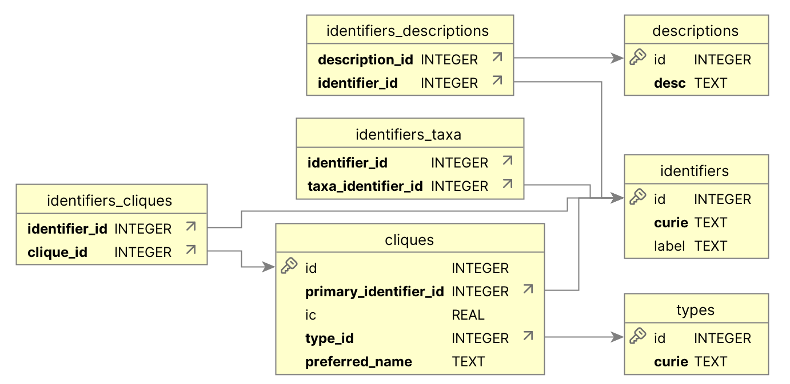

# stitch-proj
This project is a collection of tools for ingesting and querying the 
[Babel concept identifier normalization database](https://github.com/TranslatorSRI/Babel)  as a local sqlite database. 
The ingest tools automatically download Babel using "compendia" and "conflation" files from a distribution specific
[file downloads directory on the Babel webserver](https://stars.renci.org/var/babel).

# Table of Contents

- [Introduction](#introduction)
- [Quick-start: querier](#quick-start-querier)
- [Quick-start: ingester](#quick-start-ingester)
- [Tools](#tools)
- [Releases](#releases)
- [Subdirectories in `stitch-proj`](#subdirectories-in-stitch-proj)
- [Requirements](#requirements)
- [Systems on which this software has been tested](#systems-on-which-this-software-has-been-tested)
  - [Ubuntu/Xeon](#ubuntuxeon)
  - [Ubuntu/Graviton](#ubuntugraviton)
  - [MacOS/Apple Silicon](#macosapple-silicon)
- [Downloading a pre-built Babel sqlite database file](#downloading-a-pre-built-babel-sqlite-database-file)
  - [Where to place the file](#where-to-place-the-file)
- [Installing stitch-proj from PyPI](#installing-stitch-proj-from-pypi)
- [How to use the local Babel sqlite database](#how-to-use-the-local-babel-sqlite-database)
- [The local Babel sqlite database schema](#the-local-babel-sqlite-database-schema)
- [Setup of a python virtualenv for using or developing the `stitch` software](#setup-of-a-python-virtualenv-for-using-or-developing-the-stitch-software)
- [Python distribution package requirements](#python-distribution-package-requirements)
- [How to run the `stitch-proj` Babel sqlite ingest in AWS](#how-to-run-the-stitch-proj-babel-sqlite-ingest-in-aws)
- [Special instructions for running `ingest_babel.py` in an `i4i` instance with a local SSD](#special-instructions-for-running-ingest_babelpy-in-an-i4i-instance-with-a-local-ssd)
- [What if you don't want to use `run-ingest-aws.sh`, for ingesting Babel?](#what-if-you-dont-want-to-use-run-ingest-awssh-for-ingesting-babel)
- [Running the type checks, lint checks, dead code checks, and unit tests](#running-the-type-checks-lint-checks-dead-code-checks-and-unit-tests)
- [How to run just the unit test suite](#how-to-run-just-the-unit-test-suite)
- [How to run the integration tests of `ingest_babel.py`](#how-to-run-the-integration-tests-of-ingest_babelpy)
- [Analyzing the local Babel sqlite database](#analyzing-the-local-babel-sqlite-database)
- [How to regenerate the schema diagram](#how-to-regenerate-the-schema-diagram)
- [Inspecting a built Babel sqlite database file](#inspecting-a-built-babel-sqlite-database-file)
- [Packaging Process for `stitch-proj`](#packaging-process-for-stitch-proj)
  - [Project structure](#1-project-structure)
  - [pyproject.toml configuration](#2-pyprojecttoml-configuration)
  - [Install build tools](#3-install-build-tools)
  - [Build the package](#4-build-the-package)
  - [Verify the package](#5-verify-the-package)
  - [Upload to PyPI](#6-upload-to-pypi)
  - [Install from PyPI](#7-install-from-pypi)
  - [Versioning workflow](#8-versioning-workflow)
- [Cleaning build artifacts](#cleaning-build-artifacts)
- [Glossary](#glossary)
- [Contributing](#contributing)
- [License](#license)
- [How to cite Babel in a publication](#how-to-cite-babel-in-a-publication)

# Introduction
There are two types of intended user for the `stitch-proj` software:

- An **"ingester"** is someone tasked with building a local sqlite copy of
  the [Babel concept identifier normalization database](https://github.com/TranslatorSRI/Babel)
  from scratch, by running `ingest_babel.py`.
- A **"querier"** is someone developing an application (such as a BigKG
  build system) that wants to programmatically query a local Babel sqlite
  database, via the `local_babel.py` module, for node normalization or
  related lookups.

The two quick-start sections below give the shortest recipe for each
role; the remainder of this README is organized to support both, with
the querier path covered first.

# Quick-start: querier
If you just want to _query_ a pre-built Babel sqlite database from a Python
application (~250 GiB free disk required; see [Requirements](#requirements)):

```bash
# 1. Install stitch-proj from PyPI (Python 3.12+); runtime deps install automatically.
pip install stitch-proj

# 2. Download the pre-built Babel sqlite file (~217 GiB) to a location of your choice.
curl -s -L https://rtx-kg2-public.s3.us-west-2.amazonaws.com/babel-20250901-p3.sqlite \
    > babel-20250901-p3.sqlite
```

Then from Python:

```python
import stitch.local_babel as lb

conn = lb.connect_to_db_read_only("babel-20250901-p3.sqlite")
res = lb.map_curie_to_preferred_curies(conn, "MESH:D014867")
# → (("CHEBI:15377", "biolink:SmallMolecule", "MESH:D014867"),)
```

See the section
"[How to use the local Babel sqlite database](#how-to-use-the-local-babel-sqlite-database)"
below for the full `local_babel` API summary.

# Quick-start: ingester
If you want to _build_ a Babel sqlite database from scratch (~37 hours, ~600 GiB
free disk, ≥32 GiB RAM; see [Requirements](#requirements)):

```bash
# 1. Clone the repository
git clone https://github.com/Translator-CATRAX/stitch-proj.git
cd stitch-proj

# 2. Create a virtualenv (include `--dev` if you also plan to run unit tests)
./run-setup-venv.sh

# 3. Edit `run-ingest-aws.sh` and set BABEL_BASE_URL to the desired Babel release

# 4. Kick off the ingest (~37 hours)
./run-ingest-aws.sh
```

For full step-by-step AWS instructions (including the `screen`/memory-tracker
wrappers), see
"[How to run the stitch-proj Babel sqlite ingest in AWS](#how-to-run-the-stitch-proj-babel-sqlite-ingest-in-aws)"
below.

# Tools
- `ingest_babel.py`: downloads and ingests the Babel concept identifier synonymization database into a local sqlite3 relational database
- `local_babel.py`: functions for querying the local Babel sqlite database
- `row_counts.py`: a script that prints out the row counts of the tables in the local Babel sqlite database
- `babel_schema.py`: DDL constants (the `CREATE TABLE` statements and index work-plan) for the Babel sqlite database, shared between `ingest_babel.py` and `local_babel.py`
- `stitchutils.py`: utility functions used internally by the other modules (Biolink Model category lookups, argparse helpers, NaN normalization, time/duration formatting, and a timestamped stderr logger)

# Releases
Tagged releases — including the pre-built Babel sqlite database files
referenced throughout this document — are published on the project's
[Releases page](https://github.com/Translator-CATRAX/stitch-proj/releases),
along with download links, file sizes, and MD5 checksums.

# Subdirectories in `stitch-proj`
- `stitch`: python modules for `stitch-proj`, that are meant to be imported and used
- `tests`: pytest unit test modules
- `tools`: tools that are actually used in maintaining or debugging `stitch-proj`
- `old-tools`: tools that were used at one time but are now kept only for archival purposes

# Requirements
- CPython 3.12, which needs to be available in your path as `python3.12`, with the `venv` library installed and in the python path
- At least 32 GiB of system memory
- Sufficient disk space in wherever filesystem hosts your `stitch-proj` directory, which will depend on your use-case:
  - To build `babel.sqlite`, at least 600 GiB of free file system storage space (usage transiently spikes to ~522 GiB and then the final database size is ~217 GiB).
  - To use a local `babel.sqlite` in your application, 250 GiB of free system storage space to store the sqlite file.
- Linux or MacOS (this software has not been tested on Windows; see "Systems on which this software has been tested").
- If you want to download the pre-built Babel sqlite database file, you will need to have `curl` installed.
- Optionally, you can install `sqlite3_analyzer`, if you want to obtain detailed database statistics (see instructions below in this page).

# Systems on which this software has been tested
The `stitch-proj` project's module `ingest_babel.py` has been tested in three compute environments:

## Ubuntu/Xeon
- We have tested a full run of `ingest_babel.py` on this system ([release `babel-sqlite-20250331`](https://github.com/Translator-CATRAX/stitch-proj/releases/tag/babel-20250331) and [release `babel-sqlite-20250817`](https://github.com/Translator-CATRAX/stitch-proj/releases/tag/babel-20250817)). This instance has instance name `stitch2.rtx.ai` and is in the `us-west-1` AWS region.
- Ubuntu 24.04
- `i4i.2xlarge` instance (Intel Xeon 8375C processor, which is x86_64 architecture), 64 GiB of memory
- `gp3` root volume (500 GiB)
- `Nitro SSD` volume (1.7 TiB)

## Ubuntu/Graviton
- We have tested a full run of `ingest_babel.py` on this system ([release `babel-sqlite-20250123`](https://github.com/Translator-CATRAX/stitch-proj/releases/tag/babel-20250123)).
- Ubuntu 24.04
- `c7g.4xlarge` instance (Graviton3 processor, which is ARM64 architecture), 32 GiB of memory
- `gp3` root volume (800 GiB)
- CPython, Numpy, and Pandas were compiled locally using gcc/g++ with the following CFLAGS:
```-mcpu=neoverse-v1 -mtune=neoverse-v1 -march=armv8.4-a+crypto -O3 -pipe```
- To enable local compilation of CPython, Numpy, and Pandas, the following packages were `apt` installed: `sqlite3`, `build-essential`, `gcc`, `g++`, `make`, `libffi-dev`, `libssl-dev`, `zlib1g-dev`, `libbz2-dev`, `libreadline-dev`, `libsqlite3-dev`, `libncursesw5-dev`, `tk-dev`, `libgdbm-dev`, `libnss3-dev`, `liblzma-dev`, `uuid-dev`, `python3-dev`, `gfortran`, `libopenblas-dev`, `liblapack-dev`, `libfreetype6-dev`, `libpng-dev`, `libjpeg-dev`, `libtiff-dev`, `libffi-dev`, `liblzma-dev`, `pkg-config`, `cmake`, `python3.12-venv`.

## MacOS/Apple Silicon
- Only _partial_ ingests of Babel have been tested on this system type. For reasons
that are not fully understood, `ingest_babel.py` runs quite fast on the M1 Max, compared to
the Graviton3 processor. Testing has been done on the following MacOS system:
- MacOS 14.6.1
- Apple M1 Max processor, 64 GiB of memory
- Apple SSD AP2048R Media SSD (2 TiB)
- `python3.12` installed via Homebrew
- `openblas` installed via Homebrew

# Downloading a pre-built Babel sqlite database file
[`babel-20250901-p3.sqlite`](https://rtx-kg2-public.s3.us-west-2.amazonaws.com/babel-20250901-p3.sqlite)
(217 GiB) is available for download from AWS S3. For details and an MD5
checksum hash, see the [Releases page](https://github.com/Translator-CATRAX/stitch-proj/releases)
for the stitch project. You will need to download this file (or, alternatively,
build it from scratch using `ingest_babel.py`) in order to query Babel
locally or to run the unit test suite. The "-p3" on the downloadable
sqlite database indicates that the database has been patched three times:
in this case, the first patch was to add the `is_canonical` column to the `conflation_members` table
(see [stitch-proj issue 80](https://github.com/Translator-CATRAX/stitch-proj/issues/80)),
the second patch was to create an index on the column `label` in the
`identifiers` table
(see [stitch-proj issue 87](https://github.com/Translator-CATRAX/stitch-proj/issues/87)).
and a third patch was to make that index case-insensitive
(see [stitch-proj issue 92](https://github.com/Translator-CATRAX/stitch-proj/issues/92)).

## Where to place the file
A querier can put the file anywhere and pass the path to
`stitch.local_babel.connect_to_db_read_only`. **For running the unit
test suite**, however, the file must be reachable at the relative path
`db/<filename>` from the top-level `stitch-proj` directory. The easiest
way to satisfy that is:

```
cd stitch-proj
mkdir -p db
curl -s -L https://rtx-kg2-public.s3.us-west-2.amazonaws.com/babel-20250901-p3.sqlite > \
    db/babel-20250901-p3.sqlite
```

A symbolic link `db -> /some/other/path` also works, if you want to keep
the 217 GiB file off the volume hosting `stitch-proj`.

# Installing stitch-proj from PyPI

`stitch-proj` is available on PyPI and requires **Python 3.12 or newer**.

These are the instructions for installing the `stitch-proj` software package from PyPI so you can
import the `stitch.local_babel` module for querying an already-ingested Babel sqlite database.
For instructions on how to install stitch for actually _running_ a Babel sqlite ingest,
see the section "Setup of a python virtualenv for using or developing the `stitch` software"
below.

Install from PyPI:

```bash
pip install stitch-proj
```

Import in your project:

```python
import stitch.local_babel as lb
```

The `stitch-proj` package has the following runtime PyPI distribution package
dependencies (see the `[project.dependencies]` table in
[`pyproject.toml`](https://github.com/Translator-CATRAX/stitch-proj/blob/main/pyproject.toml)),
which are installed automatically by `pip install stitch-proj`:

- bmt >= 1.4.5
- htmllistparse >= 0.6.1
- requests >= 2.32.5
- pandas >= 2.2.3

These specs are declared directly in `pyproject.toml`, which is the single
source of truth for runtime dependencies.

# How to use the local Babel sqlite database

The `stitch.local_babel` module exposes functions for querying a locally
ingested Babel sqlite database. The basic pattern is to open the database
in read-only mode and call query functions against the resulting
connection (or, for batch operations, pass the database filename directly
so each worker process can open its own connection):

```python
import stitch.local_babel as lb

conn = lb.connect_to_db_read_only("db/babel-20250901-p3.sqlite")

# Resolve a CURIE to its preferred CURIE(s) and type(s):
res = lb.map_curie_to_preferred_curies(conn, "MESH:D014867")
# → (("CHEBI:15377", "biolink:SmallMolecule", "MESH:D014867"),)

# All CURIEs in the same clique as a preferred CURIE:
synonyms = lb.map_pref_curie_to_synonyms(conn.cursor(), "CHEBI:15377")
```

## Main public functions

**Connection**
- `connect_to_db_read_only(db_filename) -> sqlite3.Connection` — opens the
  database in URI read-only mode (`file:...?mode=ro`), which is safe for
  concurrent readers including worker processes in a `multiprocessing.Pool`.

**Preferred-identifier resolution (CURIE → preferred CURIE / type)**
- `map_curie_to_preferred_curies(conn, curie)` — single CURIE; returns
  tuples of `(preferred_curie, type_curie, input_curie)`.
- `map_curies_to_preferred_curies(db_filename, curies, pool=None)` — batch
  variant; if a `multiprocessing.Pool` is supplied, batches are processed
  in parallel.

**Conflation neighbors (CURIE → CURIEs in the same conflation cluster)**
- `map_curie_to_conflation_curies(conn, curie, conflation_type=None)` —
  single CURIE; optionally filter by conflation type (`"DrugChemical"` or
  `"GeneProtein"`).
- `map_curies_to_conflation_curies(db_filename, curies, pool=None)` — batch
  variant with optional parallelism.

**Clique metadata**
- `map_preferred_curie_to_cliques(conn, curie) -> tuple[CliqueInfo, ...]` —
  clique rows for a preferred CURIE.
- `map_any_curie_to_cliques(conn, curie) -> tuple[CliqueInfo, ...]` —
  clique rows reachable from any CURIE (preferred or secondary).
- `map_pref_curie_to_synonyms(cursor, pref_curie) -> set[str]` — every
  CURIE in the same clique as the preferred CURIE.

**Names, categories, taxa**
- `get_all_names_for_curie(conn, curie) -> tuple[str, ...]` — every
  non-empty name (`label` / `preferred_name`) associated with the CURIE.
- `get_categories_for_curie(conn, curie) -> tuple[str, ...]` — every type
  CURIE associated with the CURIE (via clique and conflation).
- `get_taxon_for_gene_or_protein(conn, curie) -> Optional[str]` — taxon
  CURIE for a gene/protein identifier, if one exists.

**Sampling and counts**
- `get_n_random_curies(db_filename, n, pool) -> tuple[str, ...]` — `n`
  random CURIEs from the `identifiers` table (intended for test-data
  generation).
- `get_table_row_counts(conn) -> dict[str, int]` — row count for each
  user table in the database.

## Return-type containers

The module defines two `TypedDict` containers for structured return values:

- `IdentifierInfo` — `{identifier, description, label}` for a primary
  identifier.
- `CliqueInfo` — `{id: IdentifierInfo, ic: float, type: list[str]}` for a
  single clique.

For complete usage examples — including batched parallel queries against
the local database — see the unit-test module
[`tests/test_local_babel.py`](https://github.com/Translator-CATRAX/stitch-proj/blob/main/tests/test_local_babel.py).

# The local Babel sqlite database schema
This schema diagram was generated using [DbVisualizer](https://www.dbvis.com) Free version 24.3.3.


In the `cliques` table, the combination of columns `primary_identifier_id` and
`type_id` are unique, as confirmed by this SQL query returning no rows:
```
sqlite> SELECT primary_identifier_id, type_id, COUNT(*) as count
   ...> FROM cliques
   ...> GROUP BY primary_identifier_id, type_id
   ...> HAVING COUNT(*) > 1 LIMIT 10;
```
In contrast, the column `primary_identifier_id` on the `cliques` table by itself
is not unique; there can be more than one clique with the same
`primary_identifier_id` and different `type_id` values.  A two-column uniqueness
constraint should probably be added to the `cliques` table; see issue 16:
https://github.com/Translator-CATRAX/stitch-proj/issues/16

# Setup of a python virtualenv for using or developing the `stitch` software
If you just want to _use_ the stitch software to run a Babel ingest, you can run
```
cd stitch-proj
./run-setup-venv.sh
```
But if you plan on developing, modifying, or testing the stitch software, you will 
need to include the "development" PyPI distribution package dependencies:
```
cd stitch-proj
./run-setup-venv.sh --dev
```
Or if you are using AWS,
- `ssh ubuntu@stitch2.rtx.ai` (if running in AWS); else just create a new `bash` session
- `git clone https://github.com/Translator-CATRAX/stitch-proj.git`
- `cd stitch-proj` (this is the directory that contains `pyproject.toml`)
- `./run-setup-venv.sh`
The last step above (i.e., the `pip3 install -e .` step) sets up some symbolic
links within your virtualenv, so that `stitchutils` can be imported
without manipulating the PYTHONPATH, no matter what the current working
directory is. You will need this in order for the unit test module
`tests/test_ingest_babel.py` to run successfully.

# Python distribution package requirements 
External PyPI distribution package requirements for the `stitch-proj` project are
declared in [`pyproject.toml`](https://github.com/Translator-CATRAX/stitch-proj/blob/main/pyproject.toml),
in two places: the `[project.dependencies]` table lists the runtime dependencies
needed to _use_ the software (for either querying or ingesting Babel), and the
`dev` entry of the `[project.optional-dependencies]` table lists the additional
packages needed only when _developing_ `stitch-proj` (e.g., for running
`run-checks.sh`, or for building and uploading a release to PyPI).
The `run-checks.sh` script (see section "Running
the type checks, lint checks, ..." below) depends on the packages `pytest`,
`ruff`, `vulture`, and `pylint`, all of which are listed in the `dev` extra.
The runtime dependencies are `bmt`, `htmllistparse`, `pandas`, and `requests`;
developers should install the `dev` extra as well (just use
`run-setup-venv.sh --dev`, which runs `pip install -e ".[dev]"`).

# How to run the `stitch-proj` Babel sqlite ingest in AWS
First, you need to edit `run-ingest-aws.sh` to update the value for the `BABEL_BASE_URL` 
shell variable to point to the URL for the document root directory on the Babel file
download webserver, for the most recent distribution of Babel. Then, follow these steps:
- `ssh ubuntu@my-build-instance.rtx.ai` (if running in AWS); else just create a new `bash` session
- [If you are running in an `i4i` AWS instance with a local SSD, run this command: 
`curl -fsSL https://raw.githubusercontent.com/Translator-CATRAX/stitch-proj/refs/heads/main/tools/setup-i4i-instance.sh | bash`]
- `cd stitch-proj`
- `screen` (to enter a screen session)
- `./instance-memory-tracker.sh`
- `ctrl-X D` (to exit the screen session)
- `screen` (to enter a second screen session)
- `./run-ingest-aws.sh`
- `ctrl-X D` (to exit the second screen session)
- `tail -f ingest-babel.log` (so you can watch progress)
- In another terminal session, watch memory usage using `top`

After approximately 37 hours, the ingest script should complete, leaving 
the finished database as a file
`/home/ubuntu/stitch-proj/babel.sqlite` (see `Requirements` for the expected size). 
The `ingest_babel.py` script (internally) turns off buffering for the `stdout`
and `stderr` streams, so that output logging information is seen immediately
in the logfile as soon as an update is "printed" by the python script.
This behavior cannot be overridden at the `python3.12` command-line.

# Special instructions for running `ingest_babel.py` in an `i4i` instance with a local SSD
[The instructions below have been coded up in the experimental script
[`tools/setup-i4i-instance.sh`](https://github.com/Translator-CATRAX/stitch-proj/blob/main/tools/setup-i4i-instance.sh).] The `i4i` series EC2 instances have local SSD storage
that is ephemeral, i.e., the SSD volume must be set up anew each time the instance
is started up. The `i4i.2xlarge` instance that we typically use for Babel ingests is 
`stitch2.rtx.ai`.

Every time you start the instance, you should run:
```
sudo mkdir -p /mnt/localssd
sudo lsblk
```
The last command (`sudo lsblk`) should provide the name of the 1.7 TiB local SSD device,
like `/dev/nvme1n1`. Use that in place of "`/dev/nvme1n1`" below. Continuing with the commands
that you should perform every time you start the instance:
```
sudo mkfs.ext4 /dev/nvme1n1
sudo mount /dev/nvme1n1 /mnt/localssd
sudo chown ubuntu:ubuntu /mnt/localssd
mkdir -p /mnt/localssd/stitch-proj
```
And if it is the _first time_ you are setting up the instance, you should do this step:
```
ln -s /mnt/localssd/stitch-proj /home/ubuntu/stitch-proj
```
(but that symbolic link will persist even when you stop and then start the instance).

After the above steps are done, as user `ubuntu`, 
run these steps (which are from the setup instructions 
at the top of this page):
```
cd ~
git clone https://github.com/Translator-CATRAX/stitch-proj.git
cd stitch-proj
./run-setup-venv.sh
```

# What if you don't want to use `run-ingest-aws.sh`, for ingesting Babel?
If you prefer to run `ingest_babel.py` by invoking it directly from the
command-line (rather than by using the `run-ingest-aws.sh` script), that
can be done using the `ingest-babel` script that is set up in your virtualenv. 
After setting up your virtualenv and installing `stitch-proj` using the `pip3
install -e .` command as shown above, you can run
```
venv/bin/ingest-babel COMMAND_LINE_ARGS
```
where `COMMAND_LINE_ARGS` represents the various command-line arguments you wish
to pass to the Babel ingest script, `ingest_babel.py`.  Note, if you do this,
you will want to ensure that whatever location you specify (or, alternatively,
the default location you opt to leave in place) for the `ingest_babel.py`
temporary file directory will have at least 600 GiB of free space available
(although upon script completion, `ingest_babel.py` will not need any temp
directory space). In most cases, the easiest way to ensure this is to specify,
in calling `ingest_babel.py`, the location that you choose for a temporary file
directory using the `--temp-dir` command-line option, and further, to specify a
temporary file directory location that is _in the same filesystem_ as the
location where you are configuring `ingest_babel.py` to output the Babel sqlite
file. This way, the space on the filesystem is "shared" between the temp
directory and the final output database. The `run-ingest-aws.sh` script takes
care of this, in an idempotent way, by creating a local temp dir and then
configuring `ingest_babel.py` to use that temp dir (and ensuring that the final
output Babel sqlite file goes into the same filesystem).

# Running the type checks, lint checks, dead code checks, and unit tests
These checks should be run before any commit:
```
cd stitch-proj
./run-checks.sh
```
which will run type checks (using `mypy`), lint checks (using `ruff`),
dead code tests (using `vulture`), and unit tests (using `pytest`).
Note that some of the unit tests require Internet connectivity; if
you do not have a working Internet connection, and if you run the unit
tests, you will see a `urllib.error.URLError` runtime error.

# How to run just the unit test suite
First, you need to make sure that underneath the top-level
`stitch-proj` directory, there is a subdirectory `db` containing 
the Babel sqlite file (see section 
"Downloading a pre-built Babel sqlite database file").
Then you can run the unit test suite, like this:
```
cd stitch-proj
venv/bin/pytest -v
```
Note that you should _not_ try to run the unit tests like this:
```
cd stitch-proj/tests
../venv/bin/pytest -v
```
because if you do it that way, the `test_local_babel.py` module
won't be able to find the sqlite database that it depends on, and
you will get a large number of errors from that unit test module.

# How to run the integration tests of `ingest_babel.py`
Running all three integration tests of `ingest_babel.py` 
may take up to an hour (and will require a fast Internet connection, 
since the integration tests ingest various Babel compendia and
conflation files, which they load remotely via HTTPS). To run the
tests:
```
cd stitch-proj
source venv/bin/activate
bash -x run-integration-tests.sh
```
Note, running the integration tests takes a long time (an hour and 15 minutes
at last check).

# Analyzing the local Babel sqlite database
If you are a developer looking to improve `local_babel.py`, 
consider installing and compiling `sqlite3_analyzer`, which is available
from the [sqlite software project area on GitHub](https://github.com/sqlite/sqlite).
On Ubuntu, you can just perform the following steps to have
`sqlite3_analyzer` available in `/usr/local/bin`:
```
cd stitch-proj
git clone https://github.com/sqlite/sqlite.git
cd sqlite
./configure --prefix=/usr/local
make sqlite3_analyzer
sudo cp sqlite3_analyzer /usr/local/bin
sudo chmod a+x /usr/local/bin/sqlite3_analyzer
```
On MacOS, you can just use Homebrew to install `sqlite3_analyzer`:
```
brew install sqlite-analyzer
```
which will install the program in `/opt/homebrew/bin/sqlite3_analyzer`.

One analyzes the database like this:
```
sqlite3_analyzer babel.sqlite > babel-sqlite-analysis.txt
```
The analysis should take less than an hour.

# How to regenerate the schema diagram
The schema diagram is rendered (in DbVisualizer) from a DDL script,
`ddl.sql`. First regenerate that DDL script using the `ingest-babel`
command:
```
cd stitch-proj
venv/bin/ingest-babel --print-ddl --quiet 2>ddl.sql
``` 
The `--print-ddl` flag emits the DDL to stderr and then exits without
ingesting any data; `--quiet` suppresses progress logging so that
`ddl.sql` captures only DDL statements.

Then render the schema diagram from `ddl.sql` as follows.
On macOS, run the DbVisualizer application (free version
24.3.3). If you don't see "SQLite" in the treeview control on the left, then
under the "Database" menu, select "Create Database Connection" and double-click
on "sqlite". Then, under the "File" menu select "Open...", then navigate to the new
`ddl.sql` file.  Click  the play button to load the DDL into the connected 
database. In the treeview control under "SQLite" on the left, open
"Schema" and click on "Tables". In the "Tables" view in the main application
pane, click on the "References" tab. Use macOS system screen-capture tool to
obtain a PNG of the schema diagram.

# Inspecting a built Babel sqlite database file
After building (or downloading) a Babel sqlite database, the following
quick checks are sometimes useful.

To print the row counts of every table:
```
cd stitch-proj
venv/bin/python3 stitch/row_counts.py babel.sqlite
```

To get the file size in GiB (Linux/GNU `stat`):
```
stat -c %s babel.sqlite | awk '{printf "%.2f GiB\n", $1/1024/1024/1024}'
```
(if you are on macOS, instead of using `stat`, 
substitute `gstat` from the Homebrew `coreutils` package).

# Packaging Process for `stitch-proj`

This section describes the complete process used to package and publish `stitch-proj` to PyPI.

## 1. Project structure

The project uses a flat layout: the Python package `stitch/` sits at the
repository root (no `src/` directory):

```
stitch-proj/
├── pyproject.toml
├── README.md
├── LICENSE
├── run-setup-venv.sh
├── stitch/
│   ├── __init__.py
│   ├── babel_schema.py
│   ├── ingest_babel.py
│   ├── local_babel.py
│   ├── row_counts.py
│   └── stitchutils.py
├── tests/
├── tools/
└── old-tools/
```

Key points:

- All importable code lives under `stitch/`
- Tests are outside the package (see `tests/`)
- PyPI distribution artifacts are generated into `dist/` (created at build time)
- Metadata and build configuration live in `pyproject.toml`

## 2. pyproject.toml configuration

Packaging is defined entirely in
[`pyproject.toml`](https://github.com/Translator-CATRAX/stitch-proj/blob/main/pyproject.toml)
(PEP 517/518/621 compliant). See that file for the authoritative configuration;
at a high level it covers:

- Build system (`setuptools`)
- Project metadata (name, version, Python version requirement)
- Package discovery
- Console scripts (e.g., `ingest-babel`)
- Tool configuration for `ruff` and `pytest`

## 3. Install build tools

You should already have the PyPI packages `build` and `twine` in your virtualenv from
having run `run-setup-venv.sh --dev`, and thus you just need to activate your virtualenv:
```
source venv/bin/activate
```
But if you need to manually install them for some reason, the command would be:
```bash
python -m pip install --upgrade build twine
```
The `build` and `twine` packages each perform a key function in the build process:
- `build` generates distributions
- `twine` uploads to PyPI

## 4. Build the package

From the project root:

```bash
python -m build
```

This generates:

```
dist/
├── stitch_proj-0.1.0-py3-none-any.whl
└── stitch_proj-0.1.0.tar.gz
```

Artifacts:

- `.whl` → wheel (binary distribution)
- `.tar.gz` → source distribution (sdist)

## 5. Verify the package

Optional but recommended:

```bash
twine check dist/*
```

This validates metadata and README rendering.

## 6. Upload to PyPI

To upload to PyPI:

```bash
twine upload dist/*
```

You must have:

- A PyPI account
- An API token configured (recommended)

Example using token:

```bash
twine upload -u __token__ -p <your-token> dist/*
```

## 7. Install from PyPI

After upload:

```bash
pip install stitch-proj
```

For development work, clone the repository and install the package with its
`dev` extra:

```bash
git clone https://github.com/Translator-CATRAX/stitch-proj.git
cd stitch-proj
./run-setup-venv.sh --dev
```

## 8. Versioning workflow

When releasing a new version:

1. Update version in `pyproject.toml`
2. Remove old build artifacts using the project's clean script (see
   "[Cleaning build artifacts](#cleaning-build-artifacts)" below):
   ```bash
   ./tools/clean.sh
   ```
3. Rebuild:
   ```bash
   python -m build
   ```
4. Upload:
   ```bash
   twine upload dist/*
   ```

# Cleaning build artifacts

The script [`tools/clean.sh`](https://github.com/Translator-CATRAX/stitch-proj/blob/main/tools/clean.sh)
removes the local working-directory output produced by `python -m build`
and `pip install -e .` -- specifically the `build/`, `dist/`, and
`*.egg-info/` directories at the project root. Run it from anywhere
in the repository (it `cd`s to the repo root itself):

```bash
./tools/clean.sh
```

You should run it:

- **Immediately before re-running `python -m build` to publish a new
  release** (it is step 2 of the
  [Versioning workflow](#8-versioning-workflow) above), so the new wheel
  and source distribution are assembled from a clean staging tree.
- **After switching git branches or after a rebase** that changes
  package contents, to make sure the on-disk `*.egg-info/` metadata
  matches the live source.
- **Any time you notice stale duplicates** of project Python files
  showing up under `build/lib/stitch/` (e.g., your editor's project
  search finds two copies of the same function). These files are
  snapshots from the last `python -m build`; cleaning them avoids
  confusion.

The script is idempotent and safe: if there is nothing to clean, it
prints `nothing to clean; build artifacts already absent` and exits.

# Glossary

Several terms appear repeatedly in this README and in the `stitch-proj`
codebase. Most originate in the
[Babel](https://github.com/TranslatorSRI/Babel) project and the
[Biolink Model](https://biolink.github.io/biolink-model/); the
definitions below describe how they are used in this project specifically.

- **CURIE** — a *compact URI*, an identifier of the form `prefix:localid`
  (e.g., `MESH:D014867`, `CHEBI:15377`, `NCBIGene:7157`). CURIEs are the
  standard identifier syntax used throughout the Babel sqlite database.

- **Identifier** — a single CURIE in the `identifiers` table that refers
  to one biomedical concept (a "node", in graph terms). Each identifier
  has an optional human-readable label. Multiple identifiers can refer
  to the same underlying concept; they are grouped together as a clique
  (see below).

- **Clique** — a set of identifiers all considered synonymous (referring
  to the same concept). In the database, each row of the `cliques` table
  represents one clique; its members are linked via the
  `identifiers_cliques` join table, and the clique's representative
  identifier is recorded as `primary_identifier_id`.

- **Preferred CURIE** (also called the **primary identifier** in some
  contexts, including the database schema) — the canonical CURIE chosen
  to represent a clique: the CURIE of the identifier referenced by the
  clique's `primary_identifier_id`. When you call
  `map_curie_to_preferred_curies(conn, some_curie)`, the returned tuple's
  first element is the preferred CURIE of the clique to which `some_curie`
  belongs.

- **Category / type** — the high-level Biolink type of a clique (e.g.,
  `biolink:SmallMolecule`, `biolink:Protein`, `biolink:Gene`). In the
  Biolink Model these are called **categories**; in the `stitch-proj`
  database and Python code they are called **types** (see the `types`
  table and the `type_id` column on `cliques`). The two terms refer to
  the same concept.

- **Compendium** (plural: **compendia**) — a Babel distribution file
  (typically JSON-lines) containing groups of synonymous identifiers,
  each group representing one concept. Compendia are downloaded by
  `ingest_babel.py` and parsed to populate the `cliques` and
  `identifiers` tables in the local sqlite database.

- **Conflation** — a higher-level equivalence that merges cliques across
  different Biolink categories (e.g., grouping a gene with its
  corresponding protein, or a drug with its active chemical compound).
  Conflation files from Babel enumerate such groupings; in the local
  database they are stored in `conflation_clusters` (one row per
  conflation group) and `conflation_members` (joining identifiers to
  their cluster). The two conflation types currently in use are
  `DrugChemical` and `GeneProtein`.

# Contributing
External contributions are welcome.

- **Issues / bug reports**: file at the
  [issue tracker](https://github.com/Translator-CATRAX/stitch-proj/issues).
- **External contributors**: fork the repository and open a pull request
  from your fork.
- **Team members**: use a branch-and-PR workflow against the upstream
  repository. Self-merge is fine for the project owner.
- **Setting up a development environment**: see
  "[Setup of a python virtualenv...](#setup-of-a-python-virtualenv-for-using-or-developing-the-stitch-software)".
- **Before submitting a PR**: run `./run-checks.sh` (which runs `mypy`,
  `ruff`, `vulture`, and `pytest`); see
  "[Running the type checks, lint checks, dead code checks, and unit tests](#running-the-type-checks-lint-checks-dead-code-checks-and-unit-tests)".
  Larger changes should also pass `run-integration-tests.sh`.
  Note: the project does not currently have a continuous-integration
  (CI) pipeline set up, so these local checks are the only safeguard
  against breakage.
- **Commit messages**: each commit should reference an issue number
  (e.g., "fix off-by-one in clique mapper (#42)"), unless the commit
  only touches documentation.
- **Maintainer contact**: tag [@saramsey](https://github.com/saramsey)
  on the relevant issue or PR.

# License
`stitch-proj` is distributed under the MIT License. See the
[LICENSE](https://github.com/Translator-CATRAX/stitch-proj/blob/main/LICENSE)
file for the full text.

# How to cite Babel in a publication
Please see the [Babel `CITATION.cff` file](https://github.com/TranslatorSRI/Babel/blob/master/CITATION.cff).

